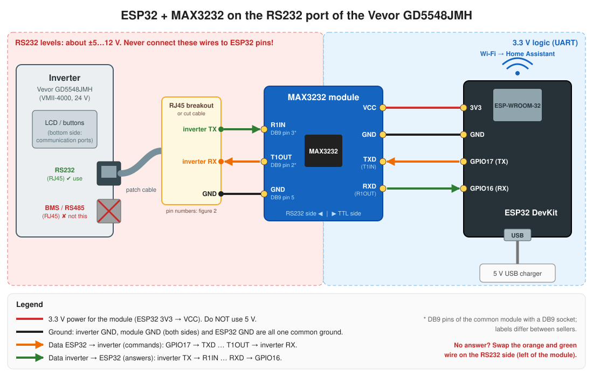
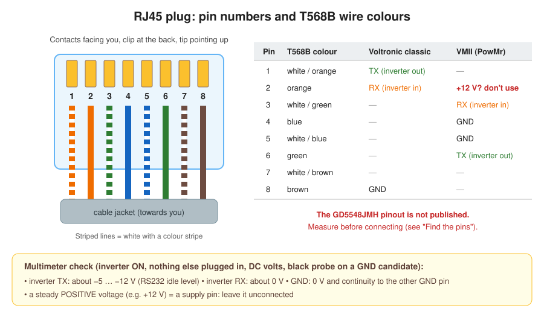

# Build guide: ESP32 + MAX3232 on the inverter's RS232 port

This is a step-by-step guide for connecting an ESP32 board to the RS232 port of the Vevor GD5548JMH (and similar Voltronic VMII inverters) through a MAX3232 level-shifter module, so Home Assistant gets the inverter data over Wi-Fi. It covers what to buy, how the parts work together, which wire goes where, how to find the right RJ45 pins with a multimeter, flashing, the first test, and troubleshooting. The firmware side (the two ESPHome configs, entities, write commands) is in [esphome.md](esphome.md). The hardware has **not yet been tested on the owner's unit**. In particular, the inverter's RJ45 pinout is not published, so step 3 (measuring) is mandatory.



## 1. How it works

```text
 Inverter                MAX3232 module                  ESP32                     Home Assistant
 RS232 port   ±5..12 V   level shifter       3.3 V       UART2 (GPIO16/17)  Wi-Fi  ESPHome API (native)
 (RJ45)     <=========>  RS232 <-> TTL     <=========>   ESPHome firmware  ~~~~~>  or TCP :8899 (bridge
                                                                                     -> HACS integration)
```

- The inverter talks **RS232**: 2400 baud, 8 data bits, no parity, 1 stop bit (8N1). RS232 uses negative voltage for logic 1 (about −5…−12 V) and positive voltage for logic 0.
- The ESP32 talks **3.3 V TTL UART** (0 V / 3.3 V). Its pins are destroyed by RS232 voltages.
- The **MAX3232** chip converts between the two. It runs on 3.3 V and generates the ±RS232 voltages itself with its charge-pump capacitors.
- The ESP32 sends a text query (for example `QPIGS` + CRC + CR), the inverter answers within about 0.2–0.7 s, and ESPHome turns the answer into sensors. Only one device may talk to the port at a time.

## 2. Parts list

| # | Part | Notes |
|---|---|---|
| 1 | **ESP32 dev board** (ESP32-WROOM-32 "DevKit V1", 30 or 38 pins) | The configs use `board: esp32dev` and GPIO16/GPIO17. Other ESP32 boards work if you change `uart_tx_pin`/`uart_rx_pin` in the YAML |
| 2 | **MAX3232 RS232↔TTL module** | Two common types, see the table below. Must be **MAX3232** (or SP3232), not MAX232: the MAX232 needs 5 V and would output 5 V into the ESP32 |
| 3 | **RJ45 cable or RJ45 breakout** | Any Ethernet patch cable that you cut open, or an RJ45 socket/plug with screw terminals. Alternative: the RJ45→DB9 cable that already works with the Elfin gateway |
| 4 | Jumper wires (female–female "Dupont") | 4 wires between the ESP32 and the TTL side of the module |
| 5 | **5 V USB power supply** + USB cable for the ESP32 | Any phone charger (0.5 A is enough). Do not power anything from the inverter's RJ45 pins |
| 6 | **Multimeter** | To find TX/RX/GND on the inverter's RJ45 (step 3) |
| 7 | Optional: DB9 male–male gender changer, DB9 screw-terminal adapter | Only for the "reuse the Elfin cable" path or a module with a DB9 socket |
| 8 | Optional: small plastic enclosure | Keep the ESP32 away from the inverter's heat sink; Wi-Fi must reach the router |

### MAX3232 module types

| Type | What it looks like | RS232 side | TTL side |
|---|---|---|---|
| **A. With DB9 socket** (most common) | Small board with a female DB9 connector and 4 pins `VCC GND TXD RXD` | DB9 **pin 2** = module output (T1OUT), **pin 3** = module input (R1IN), **pin 5** = GND (usual; some sellers swap 2/3) | `VCC` 3.3 V, `GND`, `TXD` = input from ESP32 TX, `RXD` = output to ESP32 RX |
| **B. Bare board** | Board with two pin rows, labelled `T1OUT R1IN GND` (RS232) and `VCC GND T1IN R1OUT` (TTL) | `T1OUT`, `R1IN`, `GND` pins | `T1IN` = from ESP32 TX, `R1OUT` = to ESP32 RX |

Some type-A sellers print `TXD`/`RXD` from the other point of view. If nothing answers, swapping wires (step 7) fixes this.

## 3. Find the pins on the inverter's RJ45 port

The GD5548JMH has two RJ45 sockets at the bottom: **RS232** (use this one) and **BMS/RS485** (pin 1 = 485-B, pin 2 = 485-A; **not** this one). The RS232 pinout of this model is not in the manual. Related units use two different layouts:



| RJ45 pin | T568B colour (patch cable) | Classic Voltronic / Axpert (reported) | VMII / PowMr HVM (sibling, reported) |
|---:|---|---|---|
| 1 | white/orange | **TX** (inverter out) | — |
| 2 | orange | **RX** (inverter in) | **+12 V? do not use** |
| 3 | white/green | — | **RX** (inverter in) |
| 4 | blue | — | **GND** |
| 5 | white/blue | — | GND |
| 6 | green | — | **TX** (inverter out) |
| 7 | white/brown | — | — |
| 8 | brown | **GND** | — |

Measure your unit before connecting anything:

1. Plug a cut patch cable (or a breakout) into the inverter's **RS232** socket. With a patch cable, the T568B colours above tell you the pin numbers, which is easier than counting contacts.
2. Switch the inverter on. Nothing else is plugged into the RS232 socket (no Elfin, no Wi-Fi dongle).
3. Set the multimeter to **DC volts**. Put the black probe on a GND candidate (pin 4 or pin 8). Touch each other wire with the red probe and write the readings down:

   ```text
   reading                         meaning
   -------------------------------------------------------------------------
   about -5 ... -12 V              inverter TX  (RS232 idle level)
   about 0 V                       inverter RX, unused pin, or another GND
   steady positive (e.g. +12 V)    supply pin: never connect it
   ```

4. Confirm GND: with the inverter **off**, a GND pin shows continuity (beep) to the inverter's battery negative or to the other GND pin.
5. The RX pin is usually next to TX in the same layout (pin 2 next to 1, or pin 3 next to 6 in the table above). If the TX found in step 3 matches one of the two layouts, take RX and GND from the same layout.

**Shortcut:** the cable that works with your Elfin gateway already connects the right three pins. If that gateway has a DB9 male plug, the cable ends in a DB9 **female**; a type-A MAX3232 module also has a female DB9, so you need a male–male gender changer. Then only the TX/RX order may need swapping (step 7).

## 4. Wire it

Do this with the ESP32 unplugged from USB.

### ESP32 ↔ MAX3232, TTL side (4 jumper wires)

| ESP32 pin | MAX3232 pin (type A / type B) | Wire colour in the figure |
|---|---|---|
| **3V3** | VCC | red |
| **GND** | GND | black |
| **GPIO17** (TX2) | TXD / T1IN | orange (data ESP32 → inverter) |
| **GPIO16** (RX2) | RXD / R1OUT | green (data inverter → ESP32) |

Power the module from **3V3, not 5V/VIN**. On 5 V the module's `RXD` output reaches 5 V, which is out of spec for the ESP32.

### MAX3232 RS232 side ↔ inverter (3 wires)

| MAX3232 pin (type A DB9 / type B) | Inverter RJ45 (from step 3) | Wire colour in the figure |
|---|---|---|
| DB9 pin 3 / **R1IN** | inverter **TX** | green |
| DB9 pin 2 / **T1OUT** | inverter **RX** | orange |
| DB9 pin 5 / **GND** | inverter **GND** | black |

Rule to remember: **TX always goes to RX**, on both sides of the module. Leave every other RJ45 pin unconnected. The cable can be a few metres long: 2400 baud is very tolerant.

### Final check before power-on

```text
[ ] module VCC goes to ESP32 3V3 (not 5V / VIN)
[ ] no RJ45 wire goes directly to an ESP32 pin
[ ] the "+12 V" pin (if found in step 3) is not connected
[ ] cable is in the RS232 socket, not BMS/RS485
[ ] Elfin gateway and Wi-Fi dongle are unplugged
```

## 5. Flash the firmware

Choose the config first ([esphome.md](esphome.md#which-one-to-use)): `vevor-bridge.yaml` if you keep the HACS integration (recommended as an Elfin replacement), `vevor-inverter.yaml` for a standalone ESPHome device.

**Option 1: ESPHome Dashboard add-on in Home Assistant (easiest).**

1. Install the "ESPHome Device Builder" add-on in Home Assistant.
2. Create a new device and paste the content of the chosen YAML. For `vevor-inverter.yaml` with controls, also create `packages/vevor-controls.yaml` next to it in the add-on's config folder.
3. Fill in the add-on's `secrets.yaml` with the keys from [`esphome/secrets.yaml.example`](../esphome/secrets.yaml.example).
4. The first flash goes over USB: plug the ESP32 into the computer that runs the browser and choose "Install → Plug into this computer". Later updates go over Wi-Fi.

**Option 2: command line on a PC.**

1. `pip install esphome`, copy `esphome/secrets.yaml.example` to `esphome/secrets.yaml` and fill it in.
2. Plug the ESP32 into USB, then run `esphome run esphome/vevor-bridge.yaml` (or `vevor-inverter.yaml`) and pick the serial port.
3. On Windows, run it from PowerShell or cmd, not Git Bash. If the build fails on long paths, set `$env:ESPHOME_ESP_IDF_PREFIX='C:\esb\idf'` (any short folder) and try again.

## 6. First test

1. Move the ESP32 to the inverter, connect the wires, and power the ESP32 from the USB charger.
2. Open the logs (Dashboard → "Logs", or `esphome logs esphome/<file>.yaml`).
3. **Native config:** set `logger: level: DEBUG` for the first test. Good answers look like `Sending polling command: QPIGS` → `CRC OK` → `poll QPIGS decode`; repeated `poll QPIGS timeout` lines mean no answer, `CRC NOK` means garbled data. In Home Assistant, the device appears under Settings → Devices → ESPHome; "Battery voltage" should match the inverter's LCD.
4. **Bridge config:** in Home Assistant, add the Voltronic integration with the ESP32's IP and port `8899` (delete the old Elfin entry first). The "Client connected" sensor turns on. You can also test from a PC with the read-only probe: `python tools/probe_inverter.py --host <ESP32-IP> --mode new --cmds QPI QPIGS`. Both lines should show `crc=True`, and `QPI` answers `'PI30'`.
5. The very first query after a pause is sometimes lost on this inverter. A single timeout followed by good answers is normal.

## 7. Troubleshooting

| Symptom | Likely cause | Fix |
|---|---|---|
| Only timeouts, nothing ever received | TX/RX swapped | Swap the two **data** wires on the RS232 side (green ↔ orange left of the module). If still silent, swap them back and swap on the TTL side instead |
| Only timeouts | Wrong RJ45 pins or wrong socket | Repeat step 3; make sure the cable is in the RS232 socket |
| Only timeouts | Another master on the port | Unplug the Elfin gateway / Wi-Fi dongle; stop other tools using the bridge |
| Garbage characters or CRC errors | Wrong baud rate or no common GND | Keep `baud_rate: 2400`; check the black GND wire on both sides |
| ESP32 reboots or is hot | Module on 5 V / a +12 V pin connected | Unplug at once; re-check the wiring table and step 3 |
| Device offline in Home Assistant | Wi-Fi too weak near the inverter | Use the fallback AP to check the signal; move the ESP32 or use a longer RS232 cable |
| Bridge: integration cannot connect | Wrong IP/port, or another client holds the connection | Port `8899`; only one TCP client at a time |
| Native: a setting does not change | The inverter answered `NAK` (value or command not accepted) | The DEBUG log shows `command not successful` (ACK gives `command successful`); the entity snaps back to the read value. Status of each command: [esphome.md](esphome.md#native-config-controls-package-writes) |

## 8. Safety notes

- Work on the low-voltage RS232 port only. Do not open the inverter: it holds dangerous AC and DC voltages.
- Never connect RS232 lines directly to the ESP32, and never use a pin with a positive supply voltage.
- Only one device on the RS232 port at a time.
- Settings changes (native controls, or the integration's controls) are untested on this firmware: change one value at a time and check it on the LCD.
